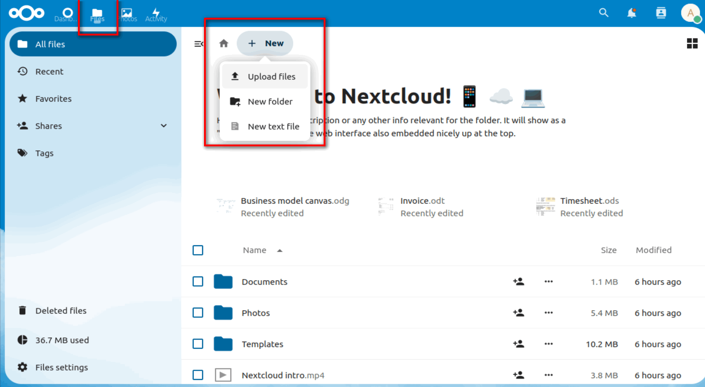
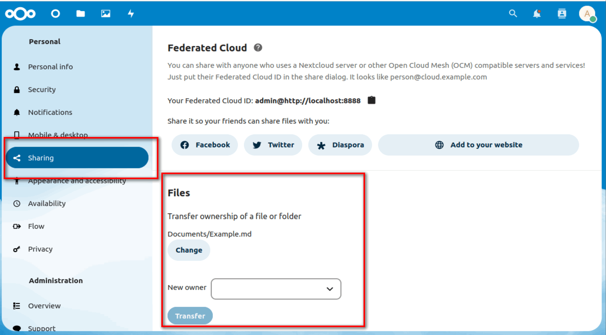
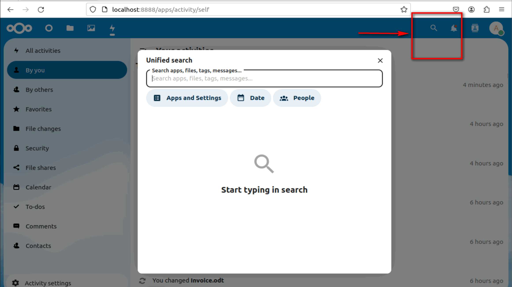

# TỔNG QUAN VỀ NETXCLOUD.

## I. KHÁI NIỆM.

NextCloud là phần mềm nguồn mở. Nó cung cấp nền tảng lưu trữ & chia sẻ File tương tự như Google Drive, Dropbox... Nhưng Bạn hoàn toàn kiểm soát được toàn bộ dữ liệu. Hơn thế nữa, NextCloud là nền tảng để có thể tích hợp thêm nhiều ứng dụng dịch vụ khác. Được phát triển bởi cộng đồng & được tài trợ bởi nhiều công ty công nghệ lớn trên thế giới.

## II. CHỨC NĂNG.

### 2.1. LƯU TRỮ DỮ LIỆU TRÊN NEXTCLOUD

- Lưu trữ tập tin: cho phép người dùng tạo thư mục, tải lên và xóa các tập tin từ máy tính hoặc thiết bị di động.

### 2.2. CHIA SẺ DỮ LIỆU.

- Chia sẻ tài liệu: cho phép người dùng chia sẻ tài liệu với người dùng khác theo các cấp độ khác nhau, ví dụ như chỉ cho phép xem hoặc sửa đổi.

- Quản lý danh bạ: cho phép người dùng quản lý danh sách liên lạc và chia sẻ danh bạ với các thành viên trong nhóm.

### 2.3. QUẢN LÝ NHIỆM VỤ.

- Lịch và nhiệm vụ: giúp người dùng quản lý thời gian và nhiệm vụ cá nhân cũng như nhóm.

### 2.4. TÌM KIẾM DỮ LIỆU.

TA có thể tìm kiếm tên file, comment hay các seting tại đây

### 2.5. CHAT.

- Chat: cho phép người dùng trò chuyện với nhau trực tiếp.
- Đồng bộ hóa dữ liệu: cho phép người dùng đồng bộ dữ liệu giữa các thiết bị khác nhau.

