#   CÀI ĐẶT ORACAL DB BY DOCKER.

buộc phải tải images của oracal Db về máy nha. cái này k tự viết dockerfile được.


## I. CÀI ĐẶT BẰNG IMAGES TỪ NHÀ PHÁT HÀNH.

## BƯỚC 1: ĐĂNG KÝ TÀI KHOẢN ORACAL DB.

Truy cập: https://container-registry.oracle.com/ords/f?p=113:10::::::

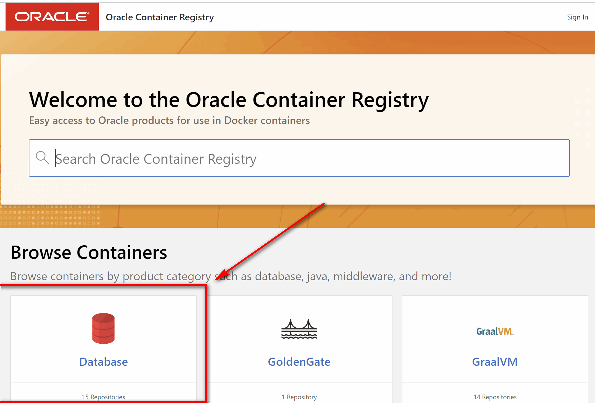

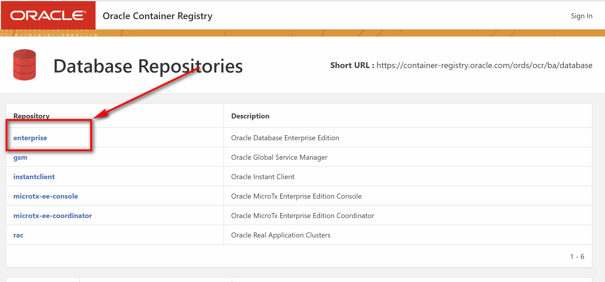

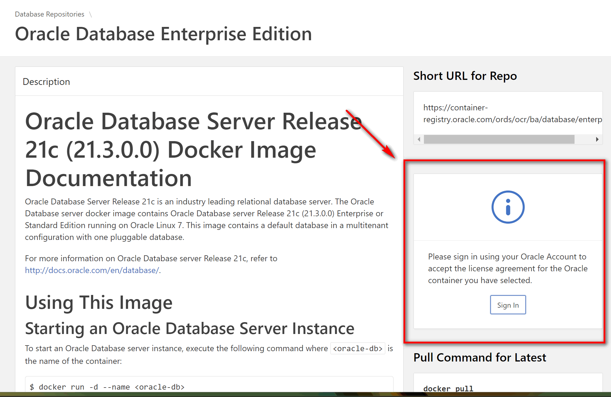


## BƯỚC 2: TẢI IMGAES ORCL DB VỀ MÁY.

ĐẦU TIÊN: HÃY LOGIN TÀI KHOẢN TRÊN MÁY BẠN. TÀI KHOẢN LÀ Ở BƯỚC 1.

`docker login container-registry.oracle.com` lệnh login 

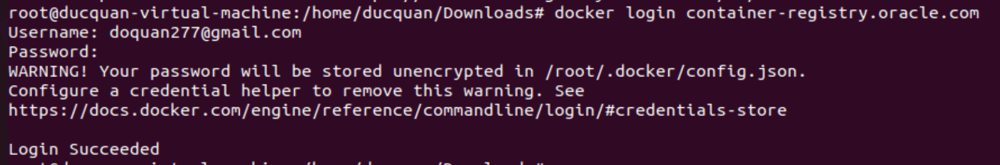


TIẾP THEO: HÃY PULL IMAGES VỀ MÁY.

ở cái trang trước khi login ơtr bước 1. ta kéo xuống tận cùng sẽ thấy rất nhiều images ta có thể pull về. Trang này nè: 
https://container-registry.oracle.com/ords/f?p=113:4:10447649744202:::4:P4_REPOSITORY,AI_REPOSITORY,AI_REPOSITORY_NAME,P4_REPOSITORY_NAME,P4_EULA_ID,P4_BUSINESS_AREA_ID:9,9,Oracle%20Database%20Enterprise%20Edition,Oracle%20Database%20Enterprise%20Edition,1,0&cs=3Gt9IwU8Uxf4RLPJNOridUr-E7XyUDtiIQ7DF1aWteVG7BmrmxbP8qkwX4ZTLw93J2alevbIRg2O609zCdcMong

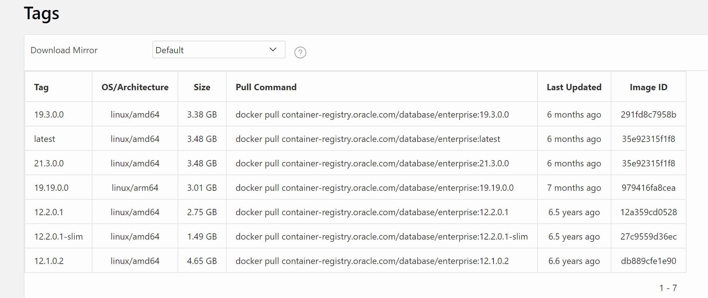


THÍCH BẢN NÀO THÌ PULL VỀ NHÉ. 

ví dụ: `docker pull container-registry.oracle.com/database/enterprise:12.1.0.2`: lệnh pull về.


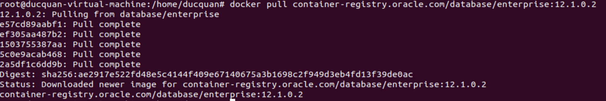


KIỂM TRA TÊN IMAGES:

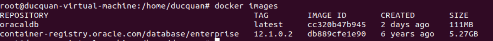


## BƯỚC 3: VIẾT DOCKER-COMPOSE CHO IMAGES NÀY ĐỂ CHẠY CHO DỄ.


LƯU Ý:  1 số khái niệm:


TÀI KHOẢN, MẬT KHẨU LÀ GÌ NHỚ ĐỂ VÔ DOCKERCOMPOSE NHA. 


lưu ý: cần tạo trước folder dboracle rồi cấp quyền đọc ghi trước nhé.

```

version: '3.1'
services:
  oracle-db:
    image: container-registry.oracle.com/database/enterprise:latest
    environment:
      - ORACLE_SID=ORCLCDB
      - ORACLE_PDB=ORCLPDB1
      - ORACLE_PWD=Oracle_123
    ports:
      - 1521:1521
    volumes:
      - ./dboracle:/opt/oracle/oradata


```


## II. CÀI ĐẶT BẰNG CÁCH TỰ BUILD IMAGES.

## BƯỚC 1. CLONNE PROJECT VỀ MÁY.

#1. cài đặt git

sudo apt-get install git

#2. Clone repo

git clone --no-checkout https://github.com/oracle/docker-images

#3. Truy cập thư mục repo

cd docker-images

#4. Cập nhật cấu hình để enable sparse checkout

git config core.sparseCheckout true

#5. Initialize sparse-checkout

git sparse-checkout init --cone

#6. Checkout thư mục Oracle database

git sparse-checkout set OracleDatabase/SingleInstance

#7. Pull data

git checkout


## BƯỚC 2: DOWLOAD BẢN CÀI ĐẶT TRÊN TRANG CHÍNH CHỦ.


TA CÓ THỂ TÌM BẢN CÀI ĐẶT Ở ĐÂY:
- VỚI BẢN VERSION TỪ 19. TRỞ ĐI: cần tải 1 file là 1 file zip đó: truy cậphttps://www.oracle.com/database/technologies/oracle-database-software-downloads.html

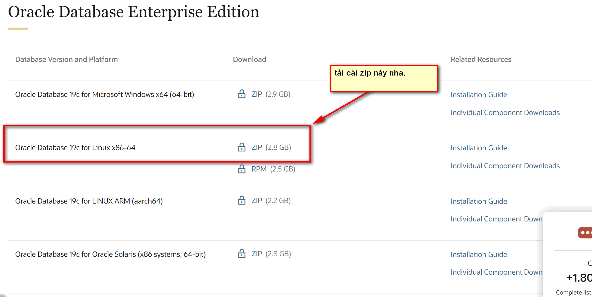


- VỚI BẢN VERSION NHỎ HƠN 19. https://edelivery.oracle.com/osdc/faces/SoftwareDelivery;jsessionid=kNDoNgLlJb0VlpMRKOibHf9w7x1pLBDmlZO-h6fV1nQ0XgAjugXA!-1114762141


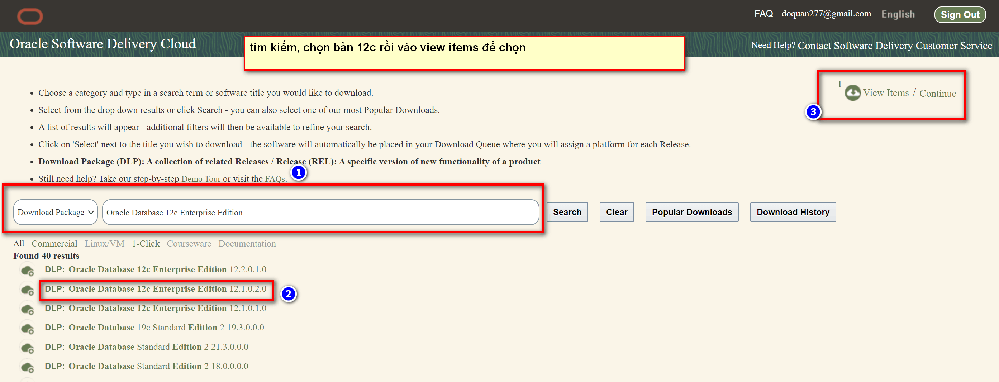

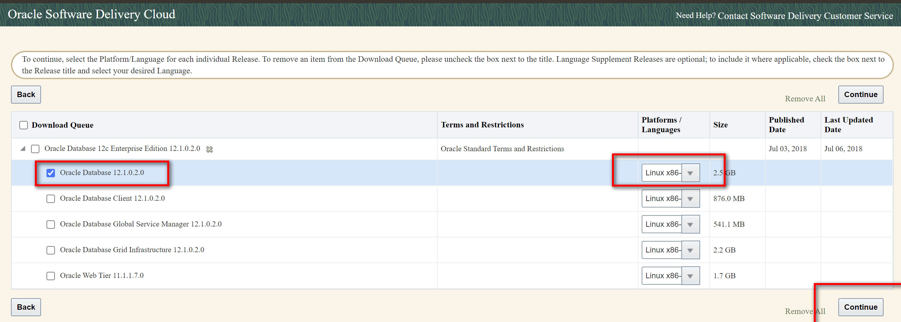

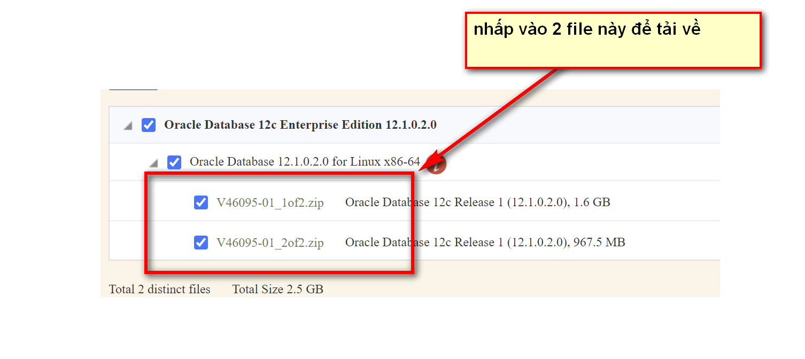


## BƯỚC 3: MOVE CÁC FILE VỪA TẢI VỀ VÀO FOLDER VERSION TƯƠNG ỨNG.

`OracleDatabase/SingleInstance/dockerfiles/<oracle-db-version>`


## BƯỚC 4: KHỞI CHẠY IMAGES.

- với bản từ 19 trở đi( file tải về là stander)
`./buildContainerImage.sh -v <oracle-db-version> -s `

- với bản 19 trở xuống( file tải về là enterprise)

`./buildContainerImage.sh -e -v <oracle-db-version> `


sau đó ta kiểm tra images: `docker images`


## BƯỚC 5: RUN CONTAINER. ĐỂ TIỆN CẦN DÙNG DOCKER-COMPOSE NHA.

y hệt cái phần trước, lật xem lại

LƯU Ý: NẾU CHẠY NÓ BÁO LỖI TÊN IMAGES THÌ CẦN CHẠY LỆNH ĐỔI TÊN IMAGES NHA. VÌ IMAGES NÓ K CHO PHÉP CÓ DẤY `/` Ở TÊN


## BƯỚC 6: DÁN THỬ VÀO DBEAVER OR CÁC TOOL KHÁC ĐỂ XEM XÉT.


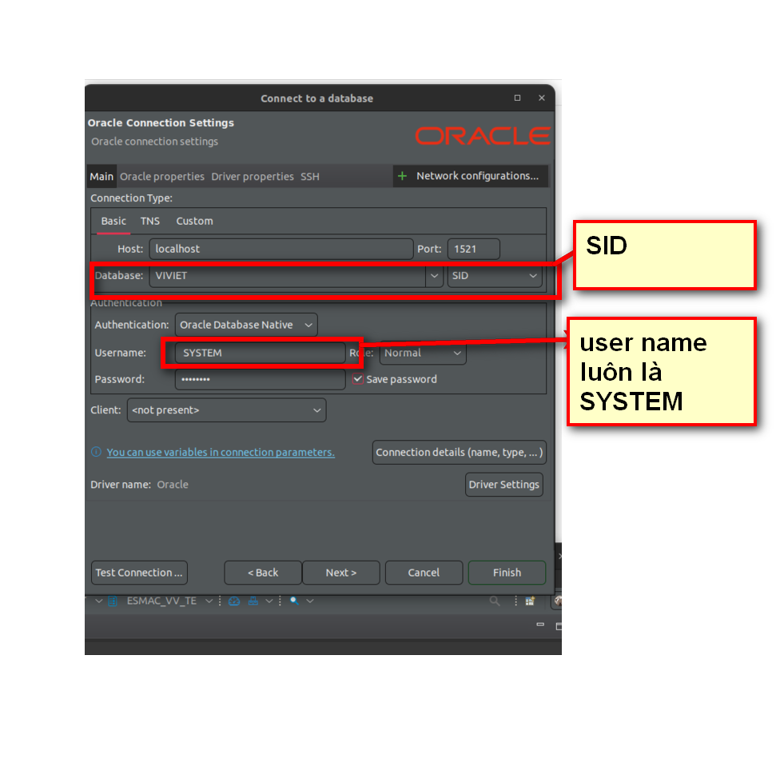


```

#1. cài đặt git

sudo apt-get install git

#2. Clone repo

git clone --no-checkout https://github.com/oracle/docker-images

#3. Truy cập thư mục repo

cd docker-images

#4. Cập nhật cấu hình để enable sparse checkout

git config core.sparseCheckout true

#5. Initialize sparse-checkout

git sparse-checkout init --cone

#6. Checkout thư mục Oracle database

git sparse-checkout set OracleDatabase/SingleInstance

#7. Pull data

git checkout


```


--- 

*THAM KHẢO*

[1] https://dev.to/chindara/install-oracle-12c-with-docker-55h7

[2] https://viblo.asia/p/dung-oracle-database-voi-docker-container-jvElakWzKkw

