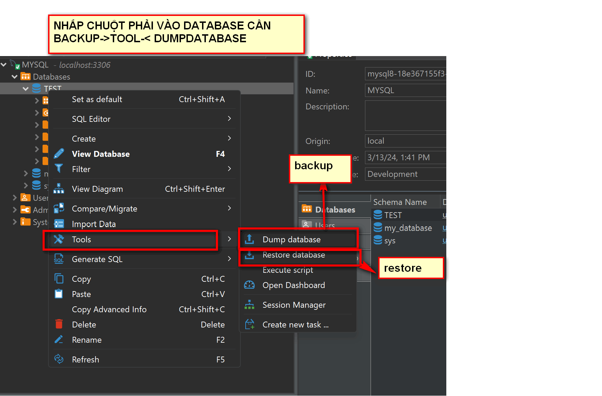

# BACKUP & RESTORE DB.

## I. HƯỚNG DẪN BACKUP- RESTORE BẰNG TOOL.

SIÊU DỄ, SIÊU ĐƠN GIẢN, K CẦN NHỚ LỆNH!

### 1.1. DBEAVER

### 1.2. DATAGRIP( THẤY LONG HAY DÙNG)

## II. BACKUP BẰNG CÂU LỆNH

### LƯU Ý: VÌ ĐANG CHẠY CONTAINER NÊN PHẢI TRUY CẬP VÀO CONTAINER TRƯỚC

`docker exec -it TÊN CONTAINER bash`: lệnh truy cập container

### 2.1. MYSQL, MARIADB.

MARIADB VÀ MYSQL TƯƠNG TỰ NHAU.

#### BACKUP:

`mysqldump -u root -p database_name > /PATH MUỐN LƯU/ database_name.sql`: lệnh backup 1 database.

`mysqldump -u root -p --databases database_name_a database_name_b > /PTAH MUỐN LƯU/databases_a_b.sql`: lưu cả database a và b vào 1 file luôn.

#### RESTORE.

`mysql -u root -p database_name < /PATH/database_name.sql`: khôi phục database

NẾU CHƯA CÓ DATABASE NHỚ TẠO NÓ NHA: 

`mysql -u root -p -e "create database database_name"`: lệnh tạo database

#### VÌ DÙNG CONTAINER NÊN TA CÓ THỂ TẠO 1 FOLDER ĐỂ BINMOUNT VÀ 1 FOLDER ĐỂ VOLUME CÁC FILE BACKUP VÀ RETORE VỀ Ở DOKER-COMPOSE. TUY NHIÊN, ĐỂ TIỆN TA CŨNG CÓ THỂ CHẠY LUÔN LỆNH CP CỦA DOCKER:

` docker cp [mysql_container_name_or_id]:/path/to/backup.sql /local/path/on/host `: Lưu tệp tin backup.sql trên máy hos

` docker cp /local/path/on/host/backup.sql [mysql_container_name_or_id]:/path/to/backup.sql `: Copy tệp tin backup.sql vào container MySQL

### 2.2. ORACLEDB.

### BACKUP.

### RESTORE.

LÊNH

---

*TÀI LIỆU THAM KHẢO*

[1] https://kdata.vn/tin-tuc/huong-dan-5-cach-backup-va-restore-mysql-database

[2] https://caitrang.com/backup-oralce-database/
